# DcodeStock - Estrutura de Código

## 📁 Organização do Código JavaScript

### Fluxo de Inicialização

```mermaid
graph TD
    A[DOMContentLoaded] --> B[Inicialização Forçada]
    B --> C[Expor Funções Globais]
    C --> D[Configurar Elementos DOM]
    D --> E[Inicializar Gráficos]
    E --> F[Setup Event Listeners]
    F --> G[Aplicar Tema]
    G --> H[Carregar Estoque Inicial]
    H --> I[Verificar Status Premium]
```



## 🏗️ Módulos Funcionais

### 1. **Core System (Linhas 1-150)**

#### Variáveis Globais e Configuração
```javascript
// Configurações do Sistema
const MAX_STOCKS = 10;
let currentStockIndex = 0;
let displayedDate = new Date();
let allStocksMeta = [];

// Estado da Aplicação
let chartPizza, chartBarras, chartSaidas;
let shareMenuOpen = false;
let notificacaoAtiva = false;
```

#### Funções Utilitárias Principais
```javascript
// Linha ~15-35
function filterUndefined(value, defaultValue = '') { /* ... */ }
function cleanText(text, defaultValue = '') { /* ... */ }

// Exposição global (Linha ~40-42)
window.filterUndefined = filterUndefined;
window.cleanText = cleanText;
```

### 2. **DOM Management (Linhas 50-120)**

#### Seleção de Elementos DOM
```javascript
// Elementos principais da interface
const mesAtualEl = document.getElementById('mesAtual');
const btnMesAnterior = document.getElementById('btnMesAnterior');
const btnProximoMes = document.getElementById('btnProximoMes');
const nomeEstoqueInput = document.getElementById('nomeEstoqueInput');
const btnNovoEstoque = document.getElementById('btnNovoEstoque');
const btnVoltarEstoque = document.getElementById('btnVoltarEstoque');
// ... mais elementos
```

#### Verificação de Elementos
```javascript
// Debug e verificação (Linha ~80-95)
console.log('Elementos DOM encontrados:', {
    mesAtualEl: !!mesAtualEl,
    btnMesAnterior: !!btnMesAnterior,
    // ... verificações
});
```

### 3. **Navigation System (Linhas 120-250)**

#### Navegação de Meses
```javascript
// Linha ~100-150
const mesesPadrao = ["Janeiro", "Fevereiro", /* ... */];
let displayedDate = new Date();

function updateMonthDisplay() {
    const meses = window.currentLanguageMonths || mesesPadrao;
    // Lógica de formatação por idioma
}

// Event Listeners de Navegação
btnMesAnterior?.addEventListener('click', () => {
    if (verificarNavegacaoPremium('navegacao_mes_anterior')) {
        // Lógica de navegação
    }
});
```

### 4. **Chart System (Linhas 250-350)**

#### Inicialização de Gráficos
```javascript
// Linha ~180-280
try {
    const ctxPizza = document.getElementById('graficoPizza')?.getContext('2d');
    const ctxBarras = document.getElementById('graficoBarras')?.getContext('2d');
    const ctxSaidas = document.getElementById('graficoSaidas')?.getContext('2d');

    if (ctxPizza && ctxBarras && ctxSaidas) {
        chartPizza = new Chart(ctxPizza, { /* configuração */ });
        chartBarras = new Chart(ctxBarras, { /* configuração */ });
        chartSaidas = new Chart(ctxSaidas, { /* configuração */ });
    }
} catch (error) {
    console.error('Erro ao inicializar gráficos:', error);
}
```

### 5. **Validation System (Linhas 350-450)**

#### Sistema de Validação
```javascript
// Linha ~320-400
function validarInput(input, tipo) {
    const valor = input.value.trim();
    let isValid = true;
    let mensagem = '';

    switch (tipo) {
        case 'item': /* validação de item */
        case 'numero': /* validação numérica */
        case 'valor': /* validação monetária */
    }
    
    // Feedback visual
    input.classList.toggle('input-erro', !isValid);
    return isValid;
}

function sanitizarDados(dados) {
    return {
        item: dados.item ? dados.item.substring(0, 50).trim() : '',
        entrada: Math.max(0, Math.min(999999, parseFloat(dados.entrada) || 0)),
        // ... sanitização
    };
}
```

### 6. **Storage System (Linhas 450-650)**

#### Sistema de Armazenamento
```javascript
// Linha ~450-500
function getStorageKey(index, date) {
    const year = date.getFullYear();
    const month = (date.getMonth() + 1).toString().padStart(2, '0');
    return `estoque_${year}-${month}_${index}`;
}

function salvarDadosDoMesAtual(index, dateToSave) {
    try {
        // Coleta de dados da tabela
        const linhasVisiveis = [...tabelaBody.querySelectorAll('tr')]
            .filter(row => !isRowEmpty(row));
        
        // Sanitização
        const dadosParaSalvar = linhasVisiveis.map(linha => {
            // Extração e sanitização de dados
        });
        
        // Salvamento
        const stockDataForMonth = {
            tableData: dadosParaSalvar,
            history: history,
            lastSaved: new Date().toISOString()
        };
        
        localStorage.setItem(storageKey, JSON.stringify(stockDataForMonth));
    } catch (error) {
        console.error('❌ Erro ao salvar dados:', error);
    }
}
```

### 7. **Table Management (Linhas 650-850)**

#### Gerenciamento da Tabela
```javascript
// Linha ~600-700
function isRowEmpty(row) {
    const inputs = row.querySelectorAll('input');
    return [...inputs].every(input =>
        input.value.trim() === '' ||
        (input.type === 'number' && (isNaN(parseFloat(input.value)) || parseFloat(input.value) === 0))
    );
}

function adicionarLinha(data = {}) {
    const linha = document.createElement('tr');
    linha.innerHTML = `
        <td><input type="text" class="item" value="${data.item || ''}" autocomplete="off" /></td>
        <td><input type="number" class="entrada" min="0" step="any" value="${data.entrada || ''}" autocomplete="off"/></td>
        <td><input type="number" class="saida" min="0" step="any" value="${data.saida || ''}" autocomplete="off"/></td>
        <td><input type="number" class="valor" min="0" step="0.01" value="${data.valor || ''}" autocomplete="off"/></td>
    `;
    tabelaBody.appendChild(linha);
    adicionarEventosLinha(linha);
}
```

### 8. **Summary and Charts (Linhas 850-1050)**

#### Sistema de Resumo
```javascript
// Linha ~750-850
function atualizarResumo() {
    let entrada = 0, saida = 0, saldo = 0, valorTotal = 0;
    const linhas = tabelaBody.querySelectorAll('tr');
    
    linhas.forEach(linha => {
        const ent = parseFloat(linha.querySelector('.entrada').value) || 0;
        const sai = parseFloat(linha.querySelector('.saida').value) || 0;
        const val = parseFloat(linha.querySelector('.valor').value) || 0;
        
        entrada += ent;
        saida += sai;
        saldo += (ent - sai);
        valorTotal += val;
    });
    
    // Atualização da interface
    entradaTotalEl.textContent = entrada;
    saidaTotalEl.textContent = saida;
    saldoTotalEl.textContent = saldo;
    valorFinalEl.textContent = valorTotal.toFixed(2);
    
    atualizarResumoItens();
}
```

### 9. **Stock Loading System (Linhas 1050-1250)**

#### Carregamento de Estoque
```javascript
// Linha ~950-1100
function loadStock(indexToLoad, previousDateForSave = null) {
    console.log('🔄 LoadStock chamado com:', { indexToLoad, previousDateForSave, currentStockIndex });
    
    // 1. Salvar dados do estoque atual
    if (currentStockIndex !== null && currentStockIndex >= 0 && currentStockIndex < MAX_STOCKS && allStocksMeta[currentStockIndex]) {
        const dateToSave = previousDateForSave || displayedDate;
        salvarDadosDoMesAtual(currentStockIndex, dateToSave);
    }

    // 2. Validar índice
    if (indexToLoad < 0) {
        indexToLoad = MAX_STOCKS - 1;
    } else if (indexToLoad >= MAX_STOCKS) {
        indexToLoad = 0;
    }

    // 3. Atualizar estado
    currentStockIndex = indexToLoad;
    localStorage.setItem('currentStockIndex', currentStockIndex);

    // 4. Carregar dados
    const storageKey = getStorageKey(currentStockIndex, displayedDate);
    let stockDataForMonth = {};
    try {
        const dadosSalvos = localStorage.getItem(storageKey);
        stockDataForMonth = JSON.parse(dadosSalvos) || { tableData: [], history: [] };
    } catch (e) {
        console.error("❌ Erro ao carregar dados:", e);
        stockDataForMonth = { tableData: [], history: [] };
    }

    // 5. Reconstruir interface
    tabelaBody.innerHTML = '';
    (stockDataForMonth.tableData || []).forEach(data => adicionarLinha(data));
    adicionarLinha(); // Linha vazia para entrada

    // 6. Atualizar tudo
    updateMonthDisplay();
    atualizarResumo();
    atualizarGraficos();
}
```

### 10. **Premium System (Linhas 1250-1650)**

#### Sistema Premium
```javascript
// Linha ~1150-1300
const CREDENCIAIS_MASTER = [
    {
        login: 'Daphiny',
        senha: '2019',
        email: 'admin@dcodestock.com'
    },
    {
        login: 'Douglas',
        senha: 'Daphiny@#2019',
        email: 'douglas@dcodestock.com'
    }
];

function verificarAssinatura() {
    console.log('🔍 Verificando assinatura...');
    
    // Verificar login ativo
    const loginAtivo = verificarLogin();
    if (loginAtivo) return true;
    
    // Verificar assinatura paga
    const assinatura = JSON.parse(localStorage.getItem('assinaturaPremium') || 'null');
    if (!assinatura) return false;
    
    const agora = new Date();
    const vencimento = new Date(assinatura.vencimento);
    
    return agora < vencimento;
}

function verificarNavegacaoPremium(acao) {
    if (verificarAssinatura()) {
        localStorage.setItem('jaTevePremium', 'true');
        return true;
    }
    
    // Forçar retorno ao estoque 1
    if (currentStockIndex !== 0 || !ehMesAtual(displayedDate)) {
        currentStockIndex = 0;
        displayedDate = new Date();
        localStorage.setItem('currentStockIndex', '0');
        loadStock(0);
        updateMonthDisplay();
    }
    
    mostrarOpcoesAcesso(acao);
    return false;
}
```

### 11. **Event Listeners Setup (Linhas 1650-2000)**

#### Configuração de Event Listeners
```javascript
// Linha ~1500-1700
// Event Listener para stock name input
if (nomeEstoqueInput) {
    nomeEstoqueInput.addEventListener('change', () => {
        salvarDadosDoMesAtual(currentStockIndex, displayedDate);
    });
}

// Botão + (próximo estoque)
if (btnNovoEstoque) {
    btnNovoEstoque.addEventListener('click', (e) => {
        e.preventDefault();
        e.stopPropagation();
        
        if (verificarNavegacaoPremium('navegacao_estoque_proximo')) {
            const proximoIndex = Math.min(currentStockIndex + 1, MAX_STOCKS - 1);
            if (proximoIndex !== currentStockIndex) {
                salvarDadosDoMesAtual(currentStockIndex, displayedDate);
                currentStockIndex = proximoIndex;
                loadStock(currentStockIndex);
            }
        }
    });
}

// Botão - (estoque anterior)
if (btnVoltarEstoque) {
    btnVoltarEstoque.addEventListener('click', (e) => {
        e.preventDefault();
        e.stopPropagation();
        
        if (verificarNavegacaoPremium('navegacao_estoque_anterior')) {
            const anteriorIndex = Math.max(currentStockIndex - 1, 0);
            if (anteriorIndex !== currentStockIndex) {
                salvarDadosDoMesAtual(currentStockIndex, displayedDate);
                currentStockIndex = anteriorIndex;
                loadStock(currentStockIndex);
            }
        }
    });
}
```

### 12. **Theme System (Linhas 2000-2100)**

#### Sistema de Temas
```javascript
// Linha ~1800-1900
function setTheme(theme) {
    console.log('Aplicando tema:', theme);
    
    document.documentElement.setAttribute('data-theme', theme);
    document.body.setAttribute('data-theme', theme);
    localStorage.setItem('theme', theme);
    
    if (themeToggle) {
        themeToggle.textContent = theme === 'dark' ? '🌙' : '☀️';
        themeToggle.title = theme === 'dark' ? 'Alternar para tema claro' : 'Alternar para tema escuro';
    }
}

// Event listener para alternância de tema
if (themeToggle) {
    themeToggle.addEventListener('click', (e) => {
        const currentTheme = document.documentElement.getAttribute('data-theme');
        const newTheme = currentTheme === 'dark' ? 'light' : 'dark';
        setTheme(newTheme);
    });
}
```

### 13. **Sharing System (Linhas 2100-2400)**

#### Sistema de Compartilhamento
```javascript
// Linha ~1950-2150
function gerarTextoCompartilhamento() {
    const nomeEstoque = cleanText(nomeEstoqueInput.value) || `Estoque ${currentStockIndex + 1}`;
    let texto = `📊 Estoque: ${nomeEstoque}\n📅 Mês: ${mesAtualEl.textContent}\n\n📦 Itens:\n`;
    
    const linhas = tabelaBody.querySelectorAll('tr');
    let hasItems = false;
    
    linhas.forEach(linha => {
        const item = linha.querySelector('.item').value.trim();
        const entrada = linha.querySelector('.entrada').value || '0';
        const saida = linha.querySelector('.saida').value || '0';
        const valor = linha.querySelector('.valor').value || '0.00';
        
        if (item) {
            hasItems = true;
            texto += `• ${item} | 📈 Entrada: ${entrada} | 📉 Saída: ${saida} | 💰 Valor: R$ ${valor}\n`;
        }
    });
    
    return texto;
}

function compartilharEstoqueAtual(tipo) {
    const texto = gerarTextoCompartilhamento();
    let url = '';
    
    switch(tipo) {
        case 'whatsapp':
            url = `https://wa.me/?text=${encodeURIComponent(texto)}`;
            break;
        case 'email':
            const subject = `Estoque ${nomeEstoqueInput.value.trim() || currentStockIndex + 1} - ${mesAtualEl.textContent}`;
            url = `mailto:?subject=${encodeURIComponent(subject)}&body=${encodeURIComponent(texto)}`;
            break;
        case 'pdf':
            gerarPDF(texto);
            return;
    }
    
    if (url) window.open(url, '_blank');
}
```

### 14. **Notification System (Linhas 2400-2700)**

#### Sistema de Notificações
```javascript
// Linha ~2200-2400
function atualizarResumoItens() {
    if (!listaResumoItens) return;
    
    const itensResumo = {};
    const linhas = tabelaBody.querySelectorAll('tr');
    
    linhas.forEach(linha => {
        const nome = linha.querySelector('.item')?.value?.trim();
        const entrada = parseFloat(linha.querySelector('.entrada')?.value) || 0;
        const saida = parseFloat(linha.querySelector('.saida')?.value) || 0;
        
        if (nome && nome !== 'undefined' && nome !== 'null' && nome.length > 0 && (entrada > 0 || saida > 0)) {
            if (!itensResumo[nome]) {
                itensResumo[nome] = { entrada: 0, saida: 0 };
            }
            itensResumo[nome].entrada += entrada;
            itensResumo[nome].saida += saida;
        }
    });
    
    // Construir interface do resumo
    listaResumoItens.innerHTML = '';
    const itensArray = Object.keys(itensResumo);
    
    if (itensArray.length === 0) {
        listaResumoItens.innerHTML = `<p class="resumo-vazio">Nenhum item inserido ainda</p>`;
    } else {
        itensArray.forEach(nome => {
            const item = itensResumo[nome];
            const saldo = item.entrada - item.saida;
            
            const divItem = document.createElement('div');
            divItem.className = 'resumo-item';
            
            let saldoClass = 'zero';
            if (saldo > 0) saldoClass = 'positivo';
            else if (saldo < 0) saldoClass = 'negativo';
            
            divItem.innerHTML = `
                <div class="resumo-item-info">
                    <div class="resumo-item-nome">${nome}</div>
                    <div class="resumo-item-valores">
                        <span class="resumo-entrada">${item.entrada}</span>
                        <span class="resumo-saida">${item.saida}</span>
                        <span class="resumo-saldo ${saldoClass}">${saldo}</span>
                    </div>
                </div>
            `;
            
            listaResumoItens.appendChild(divItem);
        });
    }
    
    verificarNotificacoes(itensArray, itensResumo);
}
```

### 15. **Login System (Linhas 2700-3200)**

#### Sistema de Login
```javascript
// Linha ~2600-3000
function realizarLogin() {
    const login = loginUsuario.value.trim();
    const senha = loginSenha.value.trim();
    
    // Remover classes de erro
    loginUsuario.classList.remove('login-error');
    loginSenha.classList.remove('login-error');
    
    if (!login || !senha) {
        if (!login) loginUsuario.classList.add('login-error');
        if (!senha) loginSenha.classList.add('login-error');
        mostrarMensagem('Por favor, preencha todos os campos.', 'erro');
        return;
    }
    
    // Verificar credenciais master
    const masterEncontrado = CREDENCIAIS_MASTER.find(master => 
        master.login === login && master.senha === senha
    );
    
    if (masterEncontrado) {
        ativarLoginPremium(login, { tipo: 'master', usuario: login, email: masterEncontrado.email });
        fecharModalLoginFn();
        mostrarMensagem(`🎉 Login Master realizado! Bem-vindo, ${login}!`, 'sucesso');
        window.location.reload();
        return;
    }
    
    // Verificar credenciais de clientes
    const usuarios = JSON.parse(localStorage.getItem('usuariosPremium') || '[]');
    const usuarioEncontrado = usuarios.find(user => 
        user.login === login && user.senha === senha && user.ativo
    );
    
    if (usuarioEncontrado) {
        const agora = new Date();
        const vencimento = new Date(usuarioEncontrado.vencimento);
        
        if (agora <= vencimento) {
            ativarLoginPremium(login, usuarioEncontrado);
            fecharModalLoginFn();
            mostrarMensagem(`🎉 Bem-vindo de volta, ${login}!`, 'sucesso');
            window.location.reload();
        } else {
            mostrarMensagem('Sua assinatura expirou.', 'erro');
        }
    } else {
        mostrarMensagem('Login ou senha incorretos.', 'erro');
    }
}
```

### 16. **Payment System (Linhas 3200-4000)**

#### Sistema de Pagamento
```javascript
// Linha ~3500-4000
function showPaymentModal() {
    console.log('🚀 showPaymentModal() chamada - abrindo modal de planos...');
    const modal = document.getElementById('modalPagamento');
    if (modal) {
        resetModalState();
        modal.classList.add('active');
        modal.style.display = 'flex';
        document.body.style.overflow = 'hidden';
        initializePaymentForm();
    }
}

function processPayment() {
    const selectedPlan = document.querySelector('.plan-option.selected');
    const selectedMethod = document.querySelector('.payment-method.active');
    
    if (!selectedPlan || !selectedMethod) {
        alert('Por favor, selecione um plano e método de pagamento.');
        return;
    }

    const plan = selectedPlan.dataset.plan;
    const method = selectedMethod.dataset.method;

    if (method === 'credit' || method === 'debit') {
        if (!validateCardForm()) return;
    }

    // Simular processamento
    const confirmBtn = document.getElementById('confirmarPagamento');
    if (confirmBtn) {
        confirmBtn.innerHTML = '<span class="btn-text">Processando...</span><span class="btn-icon">⏳</span>';
        confirmBtn.disabled = true;
    }

    setTimeout(() => {
        activatePremiumSubscription(plan, method);
        hidePaymentModal();
        
        if (confirmBtn) {
            confirmBtn.innerHTML = '<span class="btn-text">Assinar Agora</span><span class="btn-icon">🚀</span>';
            confirmBtn.disabled = false;
        }
    }, 2000);
}
```

### 17. **Final Setup (Linhas 4000-4200)**

#### Configuração Final
```javascript
// Linha ~4000-4200
// Inicialização do sistema
loadStock(currentStockIndex);

// Verificação final de segurança
setTimeout(() => {
    if (currentStockIndex !== 0) {
        console.warn('⚠️ Correção aplicada: forçando retorno ao estoque 1');
        currentStockIndex = 0;
        displayedDate = new Date();
        loadStock(currentStockIndex);
        updateMonthDisplay();
    }
    console.log('✅ Verificação de segurança concluída - Sistema no estoque 1');
}, 100);

// Garantir que o resumo seja exibido inicialmente
setTimeout(() => {
    atualizarResumoItens();
}, 500);

// Service Worker Registration
if ('serviceWorker' in navigator) {
    navigator.serviceWorker.register('sw.js')
        .then(() => console.log('Service Worker registrado com sucesso!'))
        .catch(err => console.error('Erro ao registrar Service Worker:', err));
}

// Save on page unload
window.addEventListener('beforeunload', () => {
    salvarDadosDoMesAtual(currentStockIndex, displayedDate);
});

// Expor função globalmente para o botão Premium
window.showPaymentModal = showPaymentModal;
```

## 🔄 Fluxo de Dados

### Ciclo de Vida dos Dados

```mermaid
graph LR
    A[Entrada do Usuário] --> B[Validação]
    B --> C[Sanitização]
    C --> D[Atualização da Interface]
    D --> E[Salvamento Automático]
    E --> F[localStorage]
    
    F --> G[Carregamento]
    G --> H[Reconstrução da Interface]
    H --> I[Atualização de Gráficos]
    I --> J[Verificação de Notificações]
```



### Estados da Aplicação

1. **Estado Inicial**: Estoque 1, mês atual, modo gratuito
2. **Estado Navegação**: Premium ativo, navegação livre
3. **Estado Salvamento**: Auto-save contínuo
4. **Estado Erro**: Rollback automático, logs detalhados

## 🎯 Pontos de Entrada Principais

### Funções Públicas Expostas

```javascript
// Funções utilitárias
window.filterUndefined
window.cleanText
window.updateMonthDisplay

// Sistema de pagamento
window.showPaymentModal

// Testes e debugging
window.testarModalPremium
window.testarBotaoPremium
window.testarBotoes
window.dcodeManagement.listarUsuarios
window.dcodeManagement.limparUsuarios
window.dcodeManagement.estatisticas
```

### Event Listeners Principais

1. **DOMContentLoaded**: Inicialização completa
2. **Click Handlers**: Navegação e ações
3. **Input Events**: Validação em tempo real
4. **Change Events**: Salvamento automático
5. **beforeunload**: Salvamento final

## 📊 Métricas de Código

- **Total de Linhas**: ~4200
- **Funções Principais**: ~50
- **Event Listeners**: ~25
- **Validações**: 8 tipos diferentes
- **Módulos Funcionais**: 17
- **APIs Utilizadas**: 10+

---

*Estrutura de Código - DcodeStock v2.0.0*
*Análise baseada no código JavaScript fornecido*